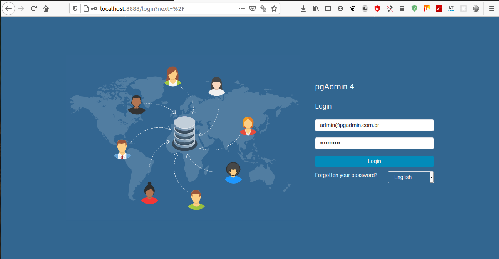
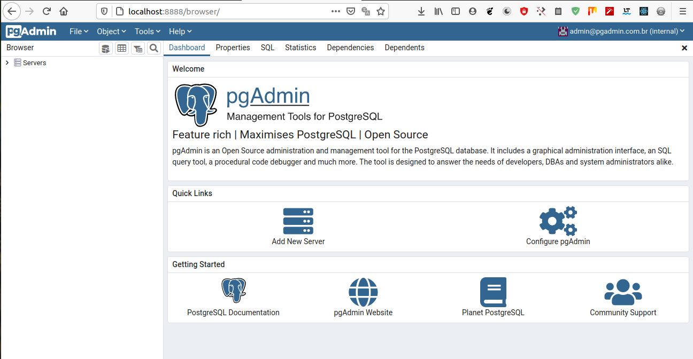
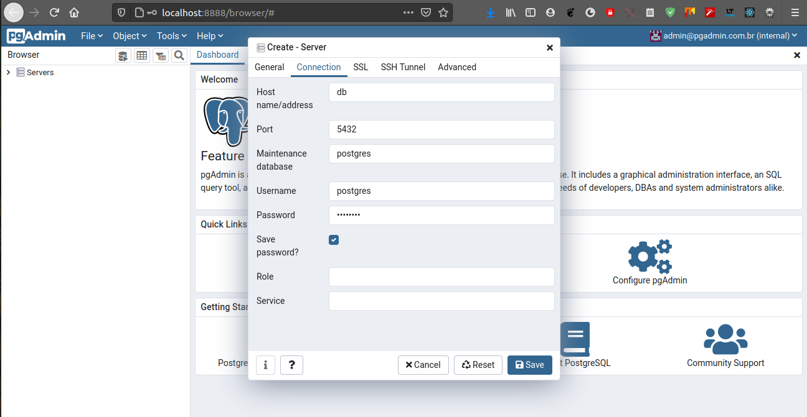
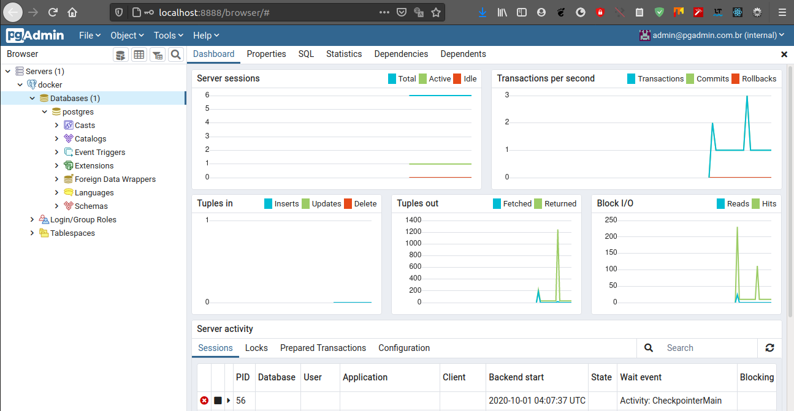

# Ambiente de Desenvolvimento Rails com Docker

## 1. Configuração dos Arquivos

Seguindo orientações da [documentação oficial do docker](https://docs.docker.com/samples/rails/) vamos criar a seguinte estrutura de arquivos:

📦Project  
 ┣ 📜Dockerfile  
 ┣ 📜Gemfile  
 ┣ 📜Gemfile.lock  
 ┣ 📜docker-compose.yml  
 ┗ 📜entrypoint.sh  

### 1.1. Dockerfile

Inicialmente vamos criar um Dockerfile que será responsável por construir a aplicação e executá-la dentro do container.

Incialmente vamos criar arquivo ```Dockerfile``` onde serão definidos a versão do ruby, os passos para instalar o nodejs as dependências necessárias para fazer o build da aplicação. A versão escolhida para o exemplo foi a 2.5.

```DOCKER
FROM ruby:2.5
RUN apt-get update -qq && apt-get install -y nodejs postgresql-client
RUN mkdir /myapp
WORKDIR /myapp
COPY Gemfile /myapp/Gemfile
COPY Gemfile.lock /myapp/Gemfile.lock
RUN bundle install
COPY . /myapp

COPY entrypoint.sh /usr/bin/
RUN chmod +x /usr/bin/entrypoint.sh
ENTRYPOINT ["entrypoint.sh"]
EXPOSE 3000

CMD ["rails", "server", "-b", "0.0.0.0"]
```

### 1.2. Gemfile

Em seguida vamos criar um arquivo ```Gemfile``` de boostrap que carrega o Rails. Esse arquivo futuramente será sobrescrito com configurações do Rails.

O arquivo conterá inicialemente a seguinto estrutura:

```RUBY
source 'https://rubygems.org'
gem 'rails', '~>5'
```

### 1.3. Gemfile.lock

Seguindo as orientações da [documentação](https://docs.docker.com/samples/rails/) do docker crie um arquivo ```Gemfile.lock``` vazio.

```BASH
docker-compose run --no-deps web rails new . --force --database=postgresql
```
### 1.4. entrypoint&#46;sh

O script ```entrypoint.sh``` impede o servidor de reiniciar quando um determinado arquivo server.pid já existe.

```BASH
#!/bin/bash
set -e
rm -f /myapp/tmp/pids/server.pid
exec "$@"
```

### 1.5. docker-compose.yml

Aqui vamos definir os serviços que vão compor a aplicação. Uma aplicação web rails, um banco de dados postgres e o facilitador pgadmin para acessar o banco de dados.

```yaml
version: "3.9"
services:
  db:
    image: postgres
    restart: always
    environment:
      POSTGRES_PASSWORD: postgres
    ports:
      - "5432:5432"
    networks:
      - rails-network
    volumes:
      - db-postgres:/var/lib/postgresql/data

  pgadmin:
    image: dpage/pgadmin4
    restart: always
    environment:
      PGADMIN_DEFAULT_EMAIL: "admin@pgadmin.com.br"
      PGADMIN_DEFAULT_PASSWORD: "pgadmin2021"
    ports:
      - 8888:80
    depends_on:
      - db
    networks:
      - rails-network

  web:
    build: .
    command: bash -c "rm -f tmp/pids/server.pid && bundle exec rails s -p 3000 -b '0.0.0.0'"
    volumes:
      - .:/my-app
    ports:
      - "3000:3000"
    depends_on:
      - db
    networks:
      - rails-network

networks:
  rails-network:
    driver: bridge

volumes:
  db-postgres: {}
```

### 1.6. Gerar a Estrura da Aplicação Rails

"Como está descrito na [documentação oficial do docker](https://docs.docker.com/samples/rails/), primeiro, o Compose cria a imagem para o serviço da web usando o Dockerfile. O ```--no-deps``` diz ao Compose para não iniciar serviços vinculados. Em seguida, ele executa novos trilhos dentro de um novo contêiner, usando essa imagem. Uma vez feito isso, você deve ter gerado um novo aplicativo."

```BASH
docker-compose run --no-deps web rails new . --force --database=postgresql
```

A estrutura de arquivos deve ser algo semelhante ao que você vê a seguir:

📦Project  
 ┣ 📂app  
 ┣ 📂bin  
 ┣ 📂config  
 ┣ 📂db  
 ┣ 📂lib  
 ┣ 📂log  
 ┣ 📂public  
 ┣ 📂storage  
 ┣ 📂test  
 ┣ 📂tmp  
 ┣ 📂vendor  
 ┣ 📜.gitignore  
 ┣ 📜.ruby-version  
 ┣ 📜config.ru  
 ┣ 📜docker-compose.yml  
 ┣ 📜Dockerfile  
 ┣ 📜entrypoint.sh  
 ┣ 📜Gemfile  
 ┣ 📜Gemfile.lock  
 ┗ 📜package.json  
 ┣ 📜Rakefile  
 ┣ 📜README.md  

### 1.7. Permissões de Arquivos
O projeto é gerado com as permissções de usuário root, então é importante alterar as permissões para o usuário corrente.

```BASH
sudo chown -R $USER:$USER .
```

### 1.8. Configurar Conexão ao Database

Para configurar a conexção vamos acessar o arquivo `database.yml` que fica dentro do diretório `config` na raiz da aplicação criada. No arquivo vamos definir o `username`, `password` e o `host` usados no arquivo `docker-compose.yml`. Lembrando que o host é o nome do serviço usado para configurar o database.

```yaml
default: &default
  adapter: postgresql
  encoding: unicode
  host: db
  username: postgres
  password: postgres
  pool: <%= ENV.fetch("RAILS_MAX_THREADS") { 5 } %>

development:
  <<: *default
  database: may-app_development

test:
  <<: *default
  database: may-app_test

production:
  <<: *default
  database: may-app_production
  username: may-app
  password: <%= ENV['DOCKER-RAILS_DATABASE_PASSWORD'] %>

```

### 1.9. Criar o Database

Para que a aplicação funcione corretamente é preciso que o banco de dados seja criado anteriormente. Caso não seja criado será exibida uma mensagem no navegador quando for feito o acesso atravavés da url [http://localhost:3000](http://localhost:3000)..

```BASH
docker-compose run web rails db:create
```

### 1.10. Migrate

O comando a seguir serve para migrar o que foi criado e entrelaçar com o banco.

```BASH
docker-compose run web rails db:migrate
```

### 1.11. Subir todo o ambiente

```BASH
docker-compose up -d
```

### 1.12. Acessar a Aplicação

Com o ambiente todo funcionando será possível acessar a aplicaçãoa través do navegador com a url [http://localhost:3000](http://localhost:3000).

Acessando a url será exibido algo parecido com a imagem abaixo.


### 1.13. Executar comandos

Para criar modelos, views e etc, use o comando:
```RUBY
docker-compose run web rails g <something> <options>
```
Exemplo para gerar um model de usuário usando a gem devise

```BASH
docker-compose run web rails g devise user
```

### 1.14. PgAdmin

Após os dois serviços subirem vamos abrir o browser e digitar a seguinte url:

[http://localhost:8888](http://localhost:8888)

A porta "8888" é a porta que foi definida no arquivo docker-compose.yml para o serviço pgadmin rodar.

Após alguns segundos será exibida a seguinte tela:



Para logar basta usar o email e password definidos no environment do serviço, que são mostrados abaixo:

Email: admin@pgadmin.com.br

Senha: pgadmin2021

Após o login será exibido o painel principal, como mostra a imagem abaixo.



### 1.15. Configure uma conexão entre o postgresql e o pgadmin

Para criar a conexão vamos clicar na opção Add New Server  e vamos inserir os dados definidos no arquivo docker-compose.yml. São eles:

* **Name** - Primeiramente vamos definir um nome qualquer para a conexão na aba "General". Eu usei o nome "docker".

* **Host name/address** - Agora na aba Connection vamos usar a url do serviço que no nosso caso é o nome do container definido, "db".

* **Port** - A porta é a padrão do postgresql, a porta "5432".

* **Username** - O username é o padrão "postgres".

* **Password** - O password é o que definimos no arquivo, "postgres".



Após salvar as configuração deverá ser exibido um dashboard como mostra a imagem abaixo e o ambiente de estudos já está pronto.


